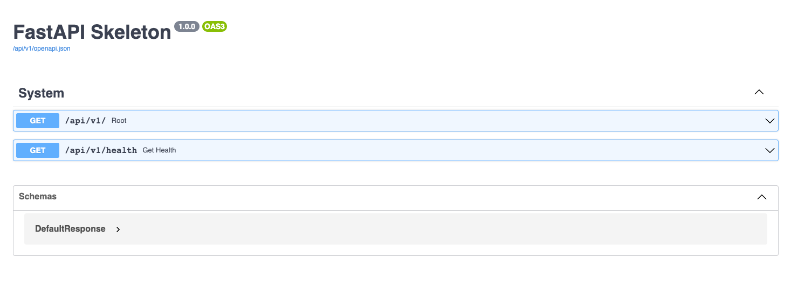

# FastAPI Skeleton App



## Features

- **Async** API
- Connection to **PostgreSQL** database
- Basic mixins for future database model (**PrimaryKeyMixin**/**TimestampsMixin**)
- **Alembic** ready with good naming convention
- **Health** endpoint to check if database is healthy

## Installation

- [With Docker](docs/installation_with_docker.md)
- [Without Docker](docs/installation_without_docker.md)

## Usage

**To add a module (admin for example) :**
- Add `admin` directory in `app/modules/admin`
- Create your `app/modules/admin/routes.py`
- Add this route to `app/routes.py` :

```python
_include_unsecured_router(admin_router, tags=["Admin"])
```

**To add a model, do this :**
- Create a `models.py` in your modules :

```python
from sqlalchemy import Boolean, Column, String

from app.db.base import Base
from app.db.mixins import BaseFeaturesMixin

class User(Base, BaseFeaturesMixin):
    __tablename__ = "adm_user"

    username = Column(String, unique=True, index=True, nullable=False)
    email = Column(String, unique=True, index=True, nullable=False)
    password = Column(String, nullable=False)
    is_active = Column(Boolean, default=False)
```
